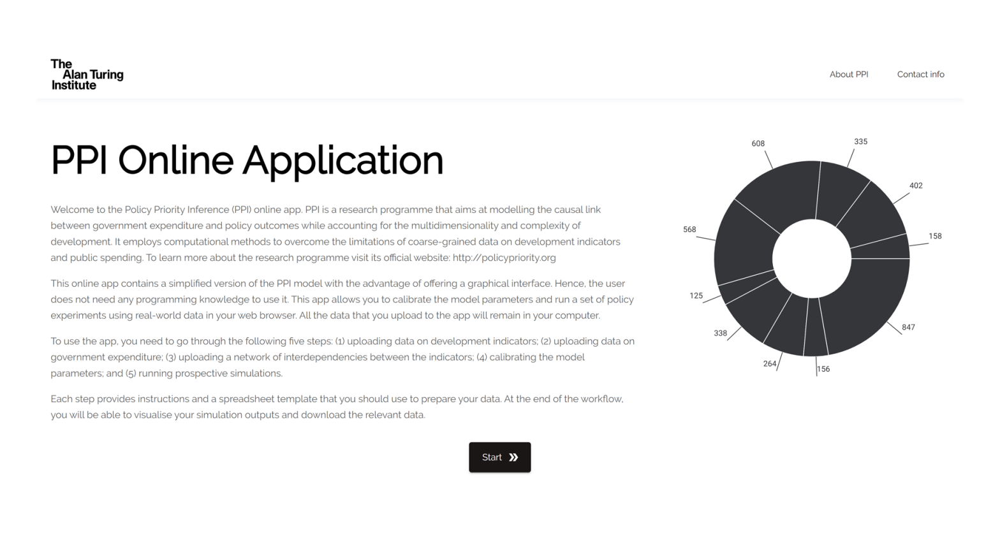
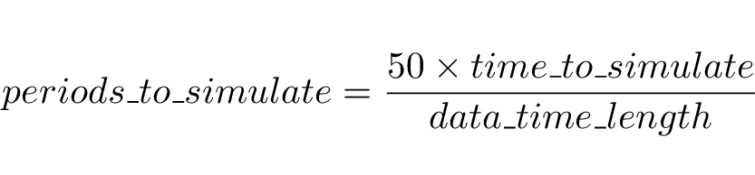

+++
title = 'The App'
date = 2023-01-01T08:00:00-07:00
draft = false
+++

{}

# The App

Learn how to launch and use the PPI app.

{} 

{}

To make PPI more accessible to different audiences, an online application with a simplified version of the model has been developed. This page guides you through the different steps that constitute the workflow of the app.

In some of these steps, you can download the data templates that are necessary to use the model. The PPI online application runs locally, so the data that you load on it will remain in your machine. 

{}
Open the app
{} 

{} 

{}

<h2>Workflow</h2>

The workflow of the app is structured in five steps. In the first three steps, you will need to provide data in an appropriate format using the provided templates. 

By the end of the workflow, you will be able to: 

<ul>
<li>train the model;</li> 
<li>visualise basic results of prospective simulations; </li>
<li>download the simulated data.</li>
</ul> 

Read each step carefully to take full advantage of the app. Should you have any questions, do not hesitate contacting PPI’s creators. 

{}

PPI needs development indicators as one of its inputs. Ideally, you should collect time series of indicators across different policy dimensions (e.g., education, governance, poverty, health, pollution). These time series should cover the same sample period and should not have missing observations. This section explains how to use these data to fill in the indicators template provided below. 

{}
Download template
{}

Before filling in the indicators template, you need to perform two preprocessing steps that you need to perform to each of your time series. First, all the values need to be re-scaled to be between 0 and 1. This will help the app to calibrate the model faster. This practice is common in development quantitative studies and usually follows the formula:

Here, max_value and min_value represent the largest and smallest observations that could be considered as potential values and, therefore, they correspond to 1 and 0 in the re-scaled series, respectively. There are different criteria to choose max_value and min_value, for example, using the theoretical limits of the indicators, using values from countries that represent best and worst cases, or taking the extreme observations in the dataset.  

In the second preprocessing step, you need to make sure that higher levels represent better outcomes. Hence, you should apply the formula inverted_value = 1 – rescaled_value to those indicators where better outcomes are measured through lower levels (e.g., inflation, mortality rates, unemployment).  

Now it is time to fill the indicators template. The template file consists of a spreadsheet that is organised in three sheets. The first one (labelled template) is the one that the PPI app will load into the model, so you should fill it with your data. The second (labelled metadata) contains detailed explanations of each of the 14 columns from the first sheet. The third sheet (labelled example) has the same structure as the first sheet but is filled with synthetic data. If you wish to use the app but have not prepared any data, you can copy the content of this sheet into the first one.  

Detailed explanations of each column in the template can be found in the metadata sheet. Here, we explain the most important columns. Each row in the template corresponds to one indicator. The indicator_label columns should contain a unique abbreviation that allows identifying each indicator. These labels are necessary and will be used to link up the indicators with the government spending data, and to produce the simulation visualisations.  

In the columns named initial_value and final_value, you should write the first and last values of the normalised time series. Column success_rate is the number of times that the indicator improved from one period to another, divided by the number of observations minus one. This quantity captures how often the indicator yields a better outcome, which relates to the success of the associated government programme. This key feature is one of the target metrics that the model will reproduce once it has been calibrated.  

The column instrumental indicates, with value 1, if there exists a government programme designed to impact the indicator. If not, the value should be 0 and the model will generate the dynamics of this indicator through inertial factors and spillovers, but not from government expenditure. The identification of instrumental indicators is a distinctive feature of the PPI model as it allows to bring important contextual information by enabling expert knowledge to inform the causal structure of spending and outcomes. 

Finally, columns monitoring and rule_of_law correspond to governance parameters quantifying how good is the monitoring of expenditure and how serious is the rule of law when it comes to punitive measures to correct inefficient practices in the public administration. Both values should be between 0 and 1, with 0 meaning no monitoring and prevalent impunity, while 1 conveys the opposite. While the app allows to specify these values for each indicator, it is often difficult to come across such disaggregated data. Hence, a common practice is to use data from governance indicators such as the ones produced by the World Bank and assume that the same governance structure applies across all policy dimensions. 

{}

 
{}

{}

There are two ways in which you can provide information about government expenditure. The first is by entering a total budget amount. This is useful when you do not have information about how the government expenditure is disaggregated. With this level of aggregation, the types of inferences that you can make will be limited to changes in the overall budget size. 

The second option is to provide a file with the budget disaggregated into expenditure programmes using the template provided below. 

{}
Download template
{} 

The template is organised in five sheets. The first two sheets (those labelled with the prefix template_) are the ones that you must fill to provide the model with data. The third sheet (labelled metadata) provides detailed explanations of the template columns. The fourth and fifth sheets (those labelled with the prefix example_) have the same structure as the first two sheets, but are filled with synthetic data that you can copy over the first sheets in case you want to try out the app. 

In contrast to the indicators data, expenditure does not need to be normalised; just make sure that all the quantities are expressed in positive numbers (zero-valued entries will yield an error message). Sheet template_expenditure has two columns: program_ID and expenditure. Each row in this sheet corresponds to a unique government programme. Now, this does not mean that you must input highly disaggregated data; only that you should provide unique categories under which the budget is distributed. For example, you could provide broad expenditure tranches such as education, social security, and environmental protection; or you could use popular development categorisation schemes such as the Sustainable Development Goals. The important thing to remember is that each entry in column program_ID should be unique, otherwise the app will not validate your data. Finally, in column expenditure, you should fill each entry with the total budget that the government spent in the corresponding programme throughout the sample period of the indicators. In the Python version of the PPI model, you can specify time-varying budgets. This, however, makes the data-preparation process much more complicated. Therefore, a design decision was made for the online app in terms of sacrificing the time dimension in government expenditure. 

Sheet template_relation_table is critical for the correct use of the PPI model, so pay close attention to how it should be filled. The purpose of this sheet is to establish the relationship structure between the government programmes and the indicators. A relationship between a programme and an indicator exists when such programme is designed to impact the indicator. Hence, when filling this sheet, you should ask yourself whether a given programme is designed to affect a specific indicator. In some cases, one government programme may be designed to affect multiple indicators, in others, multiple indicators may be impacted by the same programme, and in others, these relationships could be one-to-one. PPI is designed to work under any of these structures, and this template will help you to specify it. Notice that establishing whether a programme relates to an indicator is a question of design, not of effectiveness. Effectiveness is a matter of evaluation, and that corresponds to the PPI model, not to the preparation of data. The column named indicator_label of the template_relation_table sheet contains all the labels of the indicators that can be directly affected by government spending. These correspond to all the labels in the indicators template with a value of 1 in the column instrumental (see the indicators step of the workflow).  

Next, still in the template_relation_table sheet, we have the columns labelled program1_ID, program2_ID, …. These columns are there so you can specify the government programmes that are designed to affect each indicator. For example, if the indicator social_security in your data is impacted by programmes 2, 15, and 24, then, in the row with the label social_security, you should fill the column program1_ID with 2, program2_ID with 15, and column program3_ID with 24. The template provides 10 columns for potential programmes affecting each indicator; however, you can add more columns if needed (just follow the same nomenclature starting with the prefix program). Remember that you can only use programme IDs that you have declared in the template_expenditure sheet, otherwise the app will not validate your data. 

{}
 
{}

{}

One of the most important discussions in the sustainable development community is accounting for the complex structure of interdependencies between policy dimensions. This is why the PPI model was built with the capability of taking such structure into consideration. In other words, one of the model’s inputs is a network of conditional dependencies between all the indicators in the data. In the online app, the user can provide a file containing a matrix that captures such network. 

The template provided in this step of the workflow is organised in three sheets. The first sheet (labelled template_network) is where you must put the information about the interdependencies. The second sheet (labelled metadata) explains each column in the template. The third sheet (labelled example_network) provides an example network corresponding to the example synthetic data from the other two templates. 

{}
Download template
{} 

To fill in the template_network sheet, you must use all the labels reported in the indicators template (regardless of if they are instrumental or not). You should type those labels in every row of the first column and in every column of the first row, as shown in the example_network sheet. If you leave any indicator out, the app will not validate your data. Each entry in this matrix should be a numeric value indicating the strength of the interdependency. These values can be positive (synergies) or negative (trade-offs). The direction of a link goes from row (the sender) to column (the receiver). 

Where do you get this network from? This is a very important question that is actively discussed in the sustainable development community. The answer depends on the quality of your data and your preferences towards using a particular method for constructing networks. For example, if you have long enough time series, you could use statistical and machine learning methods to estimate the interdependencies between all the indicators. Often, data with such properties are not available, so researchers rely on expert knowledge and organise workshops to elicit responses from sector-specialists who fill in an interdependency matrix. The creators of PPI have published a comprehensive review on many of these methods. Therefore, you should familiarise yourself with the various potential ways in which you could construct these networks. 

Whether you pick a specific network-estimation method or decide to skip this workflow step is entirely up to you. For PPI, the network of interdependencies represents a long-term structural feature that is exogenous to the model, so it is not expected to change in the short run. Since the topology of this network may have properties that are peculiar or specific to a given country or region, accounting for its topology is another way in which the PPI model considers the context specificity of the economy under study. 

{}
 
{}

{}

If you already looked at the indicators template, you may have noticed the columns alpha, alpha_prime, and beta. These correspond to the parameters of the PPI model that need to be calibrated. A model parameter is a numeric variable that remains constant in the model, so it is considered exogenous within the period under study. In some cases, parameter values can be directly obtained from data. In others, the parameters may convey aggregate or residual information that is not possible to observe in real-world data. In these cases, researchers calibrate these parameters to find values that optimise certain properties of the model. This is what the calibration step does in the PPI model. 

In the PPI model, each indicator is affected by the values of these three parameters. They are what economists call “structural” parameters as they capture features of the economy. For example, since PPI is mostly concerned with the effectiveness of public spending on already existing government programmes, the redesign of such programmes is considered a long-term process that spans beyond the periods typically studied with this tool. Hence, if a programme is ill-designed, its ineffectiveness in specific indicators will be persistent through time, and this would be captured by these parameters. 

If you are using the PPI app for the first time, you will not know the values for these parameters, so you must leave those columns empty in the indicators template. The calibration step of the workflow aims at finding those parameters for you. When you hit the calibration button, the app runs an optimisation algorithm in the background to find the combination of values that best reproduces two key features that are present in the empirical indicators: the success rates that you calculate for the indicators template and the overall trend of each time series. This is a computationally intensive process for a web browser, so please be patient. 

Once the calibration has finished, these parameter values will be used in the next step of the workflow. You can also download a file with these parameters to fill the alpha, alpha_prime, and beta columns from the indicators template for future use. This means that, if you plan to use the same dataset in the future, by filling the parameter columns you can skip the calibration step and make your analysis more agile. Remember, using the same parameters is valid only is you use the same dataset. 

Finally, the PPI app gives you the option of choosing the quality of the calibration. The higher the quality the more time the calibration takes because it needs to perform more simulations to achieve higher precision. While high quality can be achieved with this app, due to the computational constraints of web browsers, this quality is still below the one that could be achieved with the Python version of the model. Therefore, you should use this app mainly for fast preliminary analyses and use the Python version of the PPI model for more rigorous studies. 

{}

{}

{}

The last step of the workflow consists of running simulations. You can reach this step only if you provide the parameter values in the indicators template or if you run the calibration in the previous step. At this point, the app assumes that the starting values for the simulations are the ones from the final_values column in the indicators template. In other words, the app is set to perform prospective simulations that would allow you study the behaviour of the indicators in the future.  

If you would like to change the initial values for the simulation (e.g., to perform retrospective analyses), you need to modify your indicators template by imputing the alternative initial values into the final_values column, along with the parameter values already calibrated so you can skip the calibration step. Notice that, to validate the indicators data, the app will check that the values in the final_values column are different from those in the initial_values column. Hence, make sure to also update the initial_values column, for example, by setting them to zero (they will not be needed because you already calibrated the model). 

Similar modifications can be made to the budget data and the network of interdependencies. In other words, if you have already calibrated the parameters, you can perform counterfactual simulations by uploading alternative data, skipping the calibration step, and running the simulations in this step. 

There is another critical aspect about this step that you need to fully understand: the time scale. Your indicators data cover a sample period with a specific time length, most likely measured in years. In the background, the app transforms these time units into ‘simulation periods’ to guarantee that the agents in the model have enough interactions to learn. By default, the app uses 50 simulation periods, so it is necessary that you convert them into the time units relevant to your analysis. For example, if your data covers 10 years, it means that, in the model, every period is equivalent to 2.4 months. Therefore, if you wish to simulate 5 years into the future, you will need to set the number of periods to 25. Calculating this equivalence is easy if you use the formula: 

Once you set the number of periods to be simulated, hit the “start simulation” button and wait. The app will present you with three plots summarising the results of your simulation and allowing you to download each one as a high-resolution image. In the background, the app runs a sample of independent simulations and computes their average or representative dynamics. If you wish to perform your own analysis on these average dynamics and create your own plots, the app gives you the option to download them. To get the most out of this tool, make sure to give the indicators intuitive labels and colours that are communicative to your audience. For instance, in the example contained in the indicators template, the colour codes have been chosen according to the Sustainable Development Goals, so the audience familiar with this international agenda can easily interpret the figures generated by the app. 

{}

{}

{}
Run the app
{} 

	 

{} 

